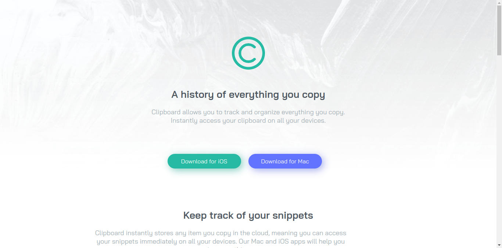

# Frontend Mentor - Clipboard landing page solution

This is a solution to the [Clipboard landing page challenge on Frontend Mentor](https://www.frontendmentor.io/challenges/clipboard-landing-page-5cc9bccd6c4c91111378ecb9). Frontend Mentor challenges help you improve your coding skills by building realistic projects. 

## Table of contents

- [Overview](#overview)
  - [The challenge](#the-challenge)
  - [Screenshot](#screenshot)
  - [Links](#links)
- [My process](#my-process)
  - [Built with](#built-with)
  - [What I learned](#what-i-learned)
  - [Continued development](#continued-development)
- [Author](#author)

## Overview

### The challenge

Users should be able to:

- View the optimal layout for the site depending on their device's screen size
- See hover states for all interactive elements on the page

### Screenshot

### Links

- Solution URL: [https://github.com/Raymacmillan/Clipboard-Landing-Page](https://github.com/Raymacmillan/Clipboard-Landing-Page)
- Live Site URL: [https://raymacmillan.github.io/Clipboard-Landing-Page/](https://raymacmillan.github.io/Clipboard-Landing-Page/)

## My process

### Built with

- Semantic HTML5 markup
- Flexbox

### What I learned

I mostly learnt about the CSS flexbox property for baseline
### Continued development

I would like to continue working on CSS Grid as i seem to have challenges with it

## Author
- Frontend Mentor - [@Raymacmillan](https://www.frontendmentor.io/profile/Raymacmillan)
- Twitter - [@RyoGenex](https://www.twitter.com/RyoGenex)
